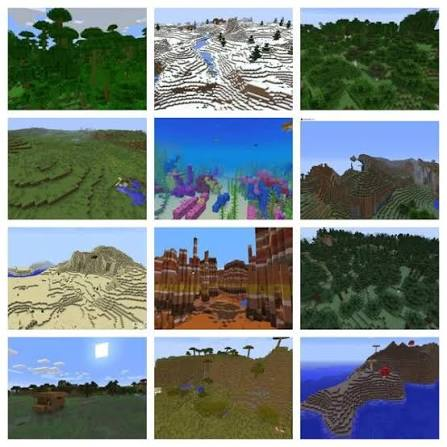

Features distinct game landscapes such as lush forests, icy mountains, desert temples, and rare structures like Woodland Mansions or Ocean Monuments.

## Visual biome guide

## Preparing for exploration

Exploration is safer with a bed, food, spare tools, a shield, torches, and a way to cross water. Bring boats for oceans and a map or written coordinates for longer journeys. A prepared inventory prevents a successful expedition from ending because of one missing item.

## Reading the landscape

Biomes influence available building materials, vegetation, weather, and the structures a player may encounter. Comparing terrain and resources helps determine where to establish outposts, farms, or a permanent base.

## Navigation habits

- Record coordinates for villages, portals, rare biomes, and useful structures.
- Use landmarks and mapped routes instead of relying on memory alone.
- Return valuable loot to a secure base before continuing farther from home.
