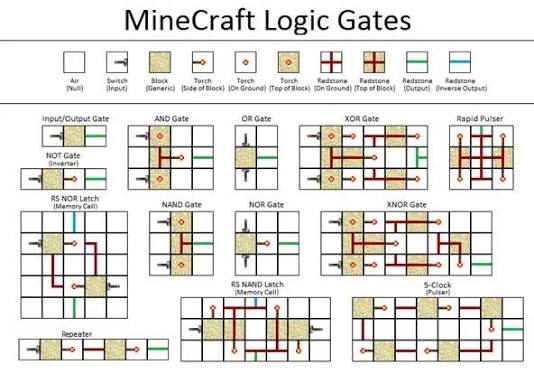

Highlights redstone wiring, repeaters, pistons, and observers used to create complex mechanisms like automatic doors or automated crop harvesters.

## Visual circuit guide

## How redstone works

Redstone carries power through dust, repeaters, comparators, and solid blocks. Understanding signal strength, timing, and input/output relationships makes it possible to design systems instead of relying only on copied builds.

## Building reliable circuits

Start with a clear goal, test each component separately, and leave space for maintenance. Repeaters can extend and delay signals, observers detect block updates, and pistons convert a redstone signal into movement. Compact designs are useful, but readable wiring is easier to repair.

## Practical applications

- Automatic crop farms reduce repetitive harvesting.
- Item sorters organize large storage systems.
- Doors, lights, and hidden entrances add useful functionality to a base.
