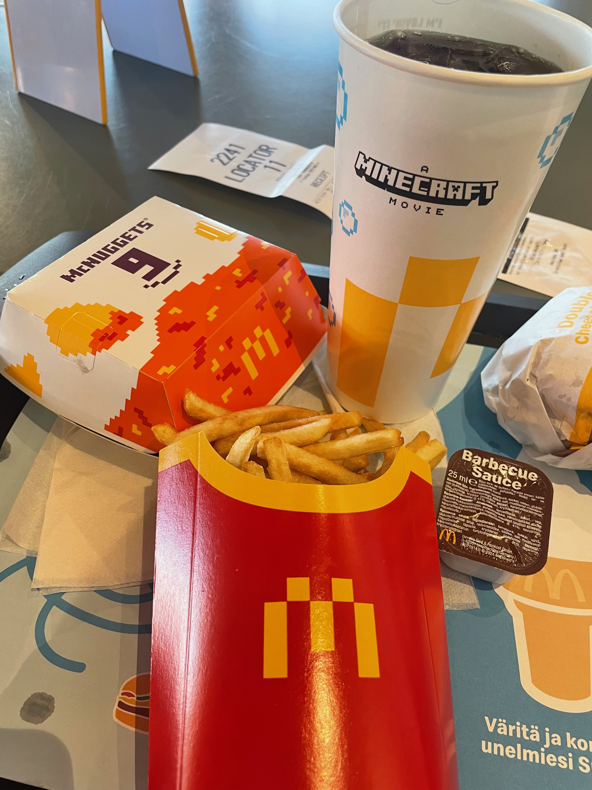

Foundational guidance for starting, preparing, and thriving in a Minecraft survival world. These five guides follow a practical progression: secure the first night, make a dependable shelter, stabilize food, mine safely, and then turn gathered resources into long-term upgrades.

## Survival Guides

1. [[first-night-plan|First-Night Plan]] - The first ten minutes, from punching wood to sleeping safely.
2. [[shelter-and-lighting|Shelter and Lighting]] - Build a base that is safe, organized, and ready to expand.
3. [[food-and-farming|Food and Farming]] - Replace emergency meals with renewable food supplies.
4. [[mining-and-ore-safety|Mining and Ore Safety]] - Gather stone and ores without losing equipment to avoidable hazards.
5. [[enchanting-and-progression|Enchanting and Progression]] - Convert a stable base into a stronger survival setup.

> Survival gets easier when each project supports the next one. A shelter protects a farm, a farm supports mining trips, and mining supplies the tools that make every later project faster.

## Field References

Minecraft-themed meal photo by [YosemiteYamper on Wikimedia Commons](https://commons.wikimedia.org/wiki/File:A_Minecraft_Movie_McDonald%27s_meal.jpg), licensed under [CC BY-SA 4.0](https://creativecommons.org/licenses/by-sa/4.0/).

### Survival Checklist

![[assets/minecraft-survival-checklist.pdf]]

This original quick-reference PDF covers Minecraft's first night, early base setup, mining preparation, and progression goals.

### Suggested Route

Start with the [[first-night-plan|first-night plan]], then improve the temporary shelter with the principles in [[shelter-and-lighting|shelter and lighting]]. Once food is renewable, follow the safety checklist in [[mining-and-ore-safety|mining and ore safety]] before working toward [[enchanting-and-progression|enchanting and progression]].
